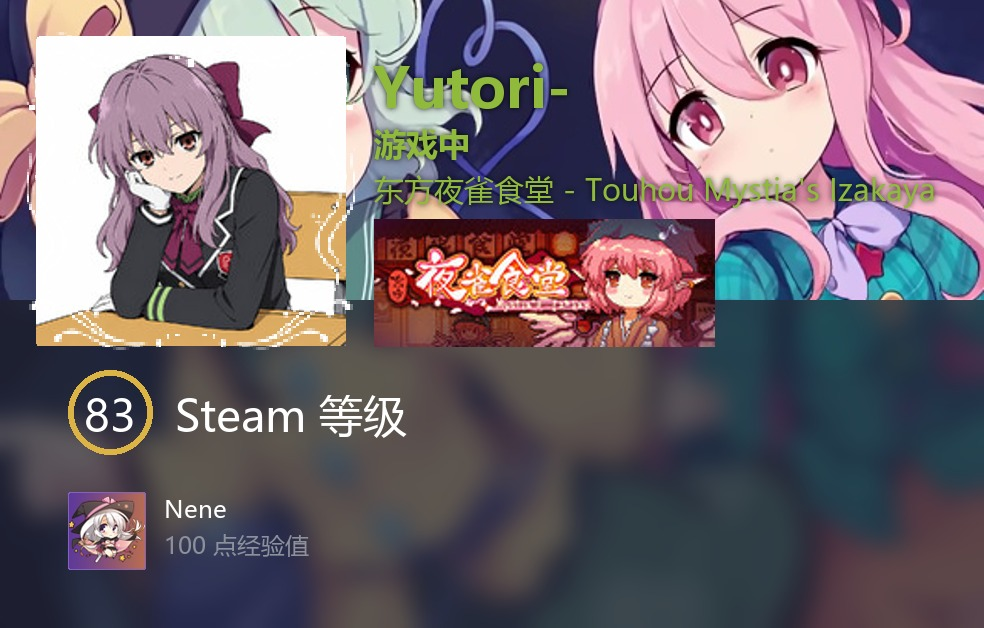
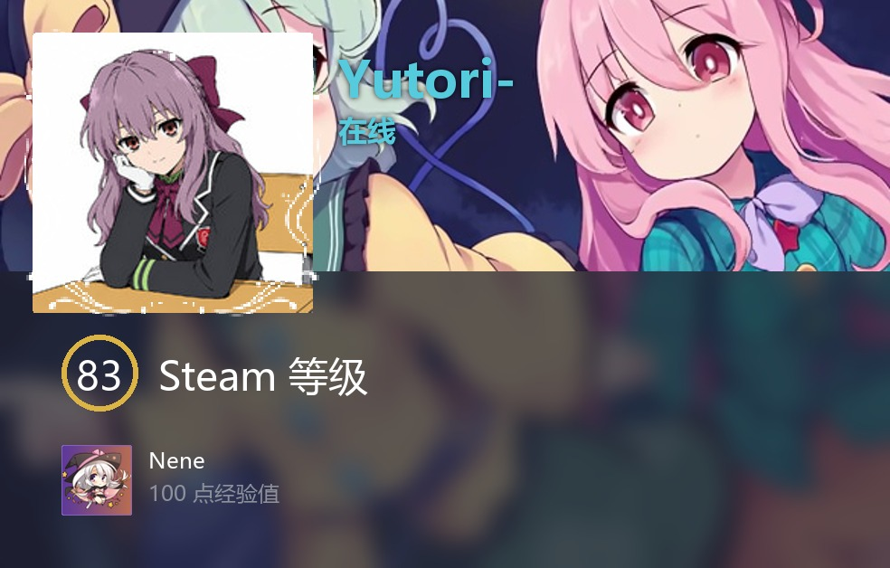
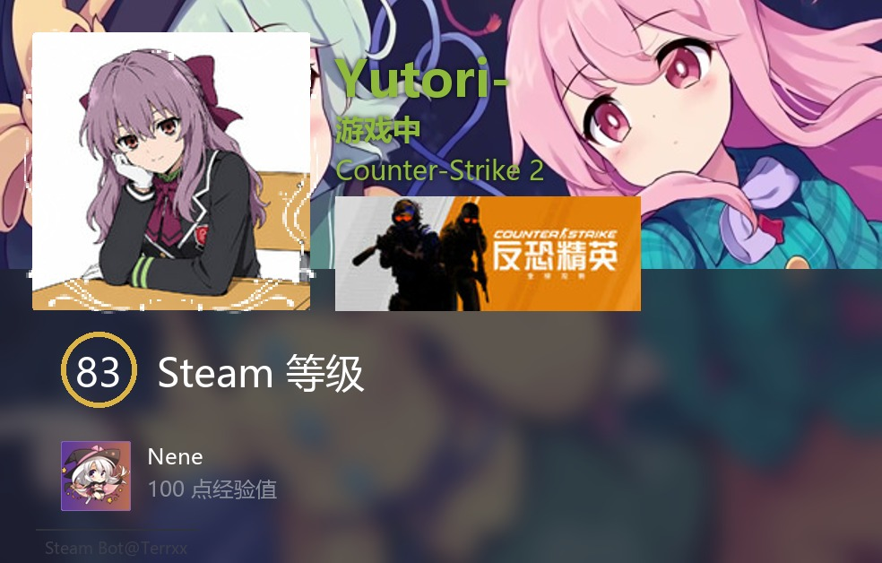
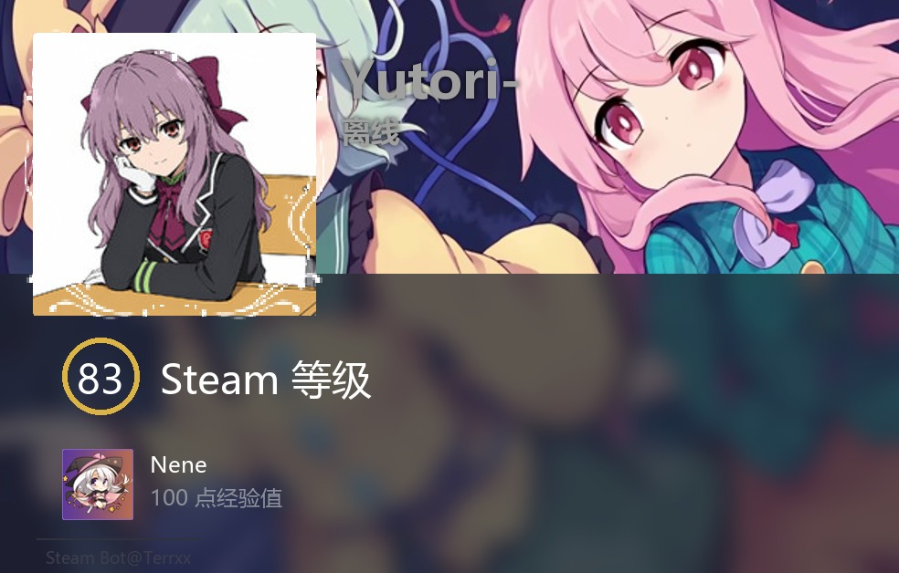
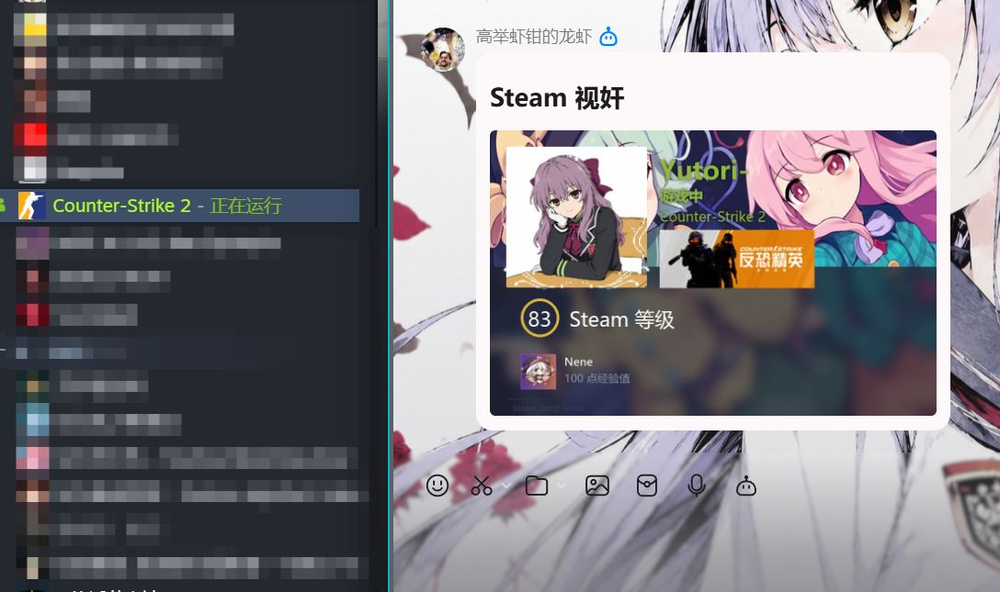
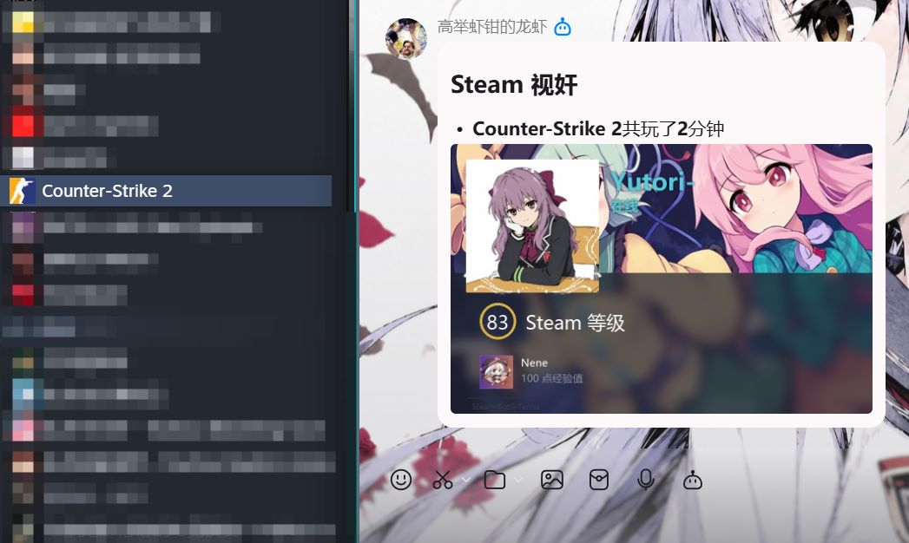

# QQ Bot — Steam 视奸 & Counter-Strike 2 机器人

基于 [QQ 开放平台](https://q.qq.com) 官方 Python SDK (`botpy`) 构建的 QQ 机器人

## Steam 视奸效果展示





---




## 🚀 快速开始

### 1. 环境要求

- Python 3.10+
- 一个 [QQ 开放平台](https://q.qq.com) 注册的机器人账号
- 腾讯云COS
- 任意AI大模型API

### 2. 安装

```bash
# 克隆项目（或直接进入项目目录）
cd qqbot_steam_cs2

# 安装依赖
pip install -r requirements.txt
```

### 3. 配置

```bash
# 复制配置模板
copy .env.example .env        # Windows
cp .env.example .env          # Linux / macOS

# 编辑 .env 填入你的信息
```

### 4. 启动

```bash
python main.py
```

看到 `机器人已上线` 就表示启动成功

### 5. 使用

在 QQ 群中 **@机器人** 或给机器人**发私聊**，使用以下命令：

| 命令 | 说明 |
|------|------|
| `/help` | 显示所有可用命令 |
| `/clear` | 清除对话上下文 |
| `/image <描述>` | AI 生成图片 |
| `/steam` | Steam 视奸 |
| `/oc` | 模拟开箱 |

## Steam 视奸
自动爬取指定Steam账户状态并在指定群播报状态  


## 📁 项目结构

```
qqbot/
├── main.py                   # 入口文件，启动机器人
├── config.py                 # 配置管理（读取 .env）
├── handlers/
│   ├── event_handler.py      # 事件处理器（消息接收与回复）
│   └── command_handler.py    # 命令注册与路由
├── services/
│   ├── ai_service.py         # AI 大模型对话服务
│   ├── cos_service.py        # 腾讯云 COS 服务
│   ├── scheduler_service.py  # 定时任务服务
│   └── image_service.py      # 图片处理服务
│   └── steam_service.py      # Steam视奸服务
├── utils/
│   └── ...                   # 工具
├── requirements.txt          # Python 依赖
├── .env.example              # 配置模板
├── allSkin.json              # CS2箱子数据
└── README.md
```

## AI 大模型配置示例

### 使用 OpenAI
```env
AI_API_KEY=sk-xxxxxxxx
AI_API_BASE=https://api.openai.com/v1
AI_MODEL=gpt-4o-mini
```

### 使用 DeepSeek
```env
AI_API_KEY=sk-xxxxxxxx
AI_API_BASE=https://api.deepseek.com
AI_MODEL=deepseek-v4-flash
```